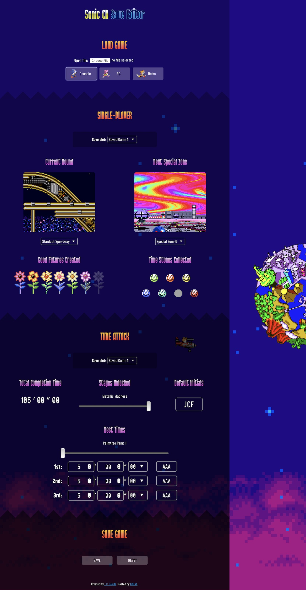
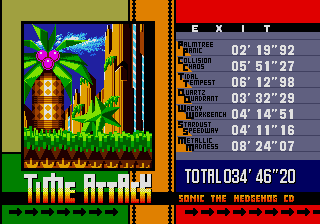

# sonic-cd-save-editor

A [save game editor for *Sonic CD*](https://jcfieldsdev.github.io/sonic-cd-save-editor/). Written in JavaScript. *Sonic CD* is a platform game released for the Sega CD in 1993. The editor works with emulator saves for the original console game as well as with the PC re-releases.

Some extra modes are enabled by a low **Total Completion Time**:

- Under 37&prime; 27&Prime; 57 unlocks the *D.A. Garden* (*Play Music* in the original PC version).
- Under 30&prime; 21&Prime; 05 unlocks Special Zones in *Time Attack*.
- Under 25&prime; 46&Prime; 12 unlocks *Visual Mode*.

The game must be completed, with **Stages Unlocked** set to "Metallic Madness," to unlock these modes. For the Sega CD version, it is also necessary to load *Time Attack* before these options are available on the title screen.

The [saves](https://github.com/jcfieldsdev/sonic-cd-save-editor/tree/master/saves) directory contains saves in different formats for testing purposes.

## Specifications

- [Console save format](https://github.com/jcfieldsdev/sonic-cd-save-editor/-/blob/master/CD%20save%20format.md)
- [PC save format](https://github.com/jcfieldsdev/sonic-cd-save-editor/-/blob/master/PC%20save%20format.md)
- [Retro save format](https://github.com/jcfieldsdev/sonic-cd-save-editor/-/blob/master/Retro%20save%20format.md)

## Compatibility

### Overview

| | Release | Platform | Year |
| -- | -- | -- | -- |
| ✅ | *Sonic CD* | Sega CD/Mega CD | 1993 |
| ✅ | *Sonic CD* (Sega PC) | Windows | 1996 |
| ✅ | *Sonic CD* (Retro Engine) | Windows | 2011 |

### Sega CD/Mega CD

Tested for Kega Fusion, Gens, and Genesis Plus saves. May or may not work with other emulators. To save files in this format, select "Console."

The editor is intended for use with save files where *Sonic CD* is the first and only save in the file.

The **Default Initials** setting is only used by this format.

### Sega PC

This is the original Sega PC version for Windows 95. It is still playable on modern versions of Windows with [Sega PC Reloaded](https://www.pcgamingwiki.com/wiki/Sonic_CD_(1996)). To save files in this format, select "PC."

The save file is located at `[path to game]\s_score.dat`. Save files contain 6 separate slots.

The **Save Slots** section is only used by this format.

### Retro Engine

This is the [Retro Engine remake](http://info.sonicretro.org/Sonic_the_Hedgehog_CD_(2011)) released for [Windows on Steam](https://store.steampowered.com/app/200940/Sonic_CD/) and for various console and mobile platforms. To save files in this format, select "Retro."

On Windows, the save file is located at `C:\Program Files (x86)\Steam\userdata\[identifier]\200940\local\sdata.bin`. Save files contain 4 *Single-Player* slots and 1 *Time Attack* slot.

The **Character**, **Lives**, **Score**, **Act**, **Currently Playing**, **Machines Destroyed**, and **Holograms Destroyed** settings and the **Options** section are only used by this format.

The **Mobile Version** checkbox is used for the Android and iOS versions of the game, which store audio volumes differently from the Windows version. The editor tries to automatically identify the version when opening an existing save file.

## Acknowledgments

PC version save obfuscation and checksum algorithms taken from [C decompilation](https://github.com/sonicretro/scdpc_disasm) provided by [MainMemory](http://mm.reimuhakurei.net/).

Retro save format based on specifications by BiafraRepublic and RetroKoH for the [Android version](https://forums.sonicretro.org/index.php?threads/sonic-cd-for-android-save-game-hacking-guide-1-0.27437/) and [iOS version](https://forums.sonicretro.org/index.php?threads/sonic-cd-2011-save-game-hex-editing-guide.29552/) respectively.

[Sega CD](https://www.spriters-resource.com/genesis_32x_scd/sonicthehedgehogcdsegacd/) and [Retro Engine](https://www.spriters-resource.com/pc_computer/soniccd2011/) sprite rips taken from [The Spriters Resource](https://www.spriters-resource.com/).

Uses [Classic Metal Sonic icon](https://www.deviantart.com/nibroc-rock/art/Vector-Icon-Classic-Metal-Sonic-618814272) by [Nibroc-Rock](https://www.deviantart.com/nibroc-rock).

Uses [Mohave](https://github.com/tokotype/Mohave-Typefaces) font by [Tokotype](https://www.tokotypefaces.com/) and [SF Port McKenzie](https://www.shyfoundry.com/fonts/shareware/sfportmcke.html) font by [ShyFoundry Fonts](https://www.shyfoundry.com/).

## Authors

- J.C. Fields <jcfields@jcfields.dev>

## License

- [MIT license](https://opensource.org/licenses/mit-license.php)

## See also

- [*Sonic 3* Save Editor](https://github.com/jcfieldsdev/sonic3-save-editor)—A save editor for the Genesis games *Sonic 3* and *Sonic 3 & Knuckles*.
- [*Knuckles Chaotix* Save Editor](https://github.com/jcfieldsdev/chaotix-save-editor)—A save editor for the 32X game *Knuckles Chaotix*.
- [*Tails Adventure* Password Generator](https://github.com/jcfieldsdev/tailsadv-password-generator)—A similar tool for the Game Gear game *Tails Adventure*.
- [*Sonic Mania* Save Editor](https://github.com/jcfieldsdev/sonic-mania-save-editor)—A save editor for *Sonic Mania*.
